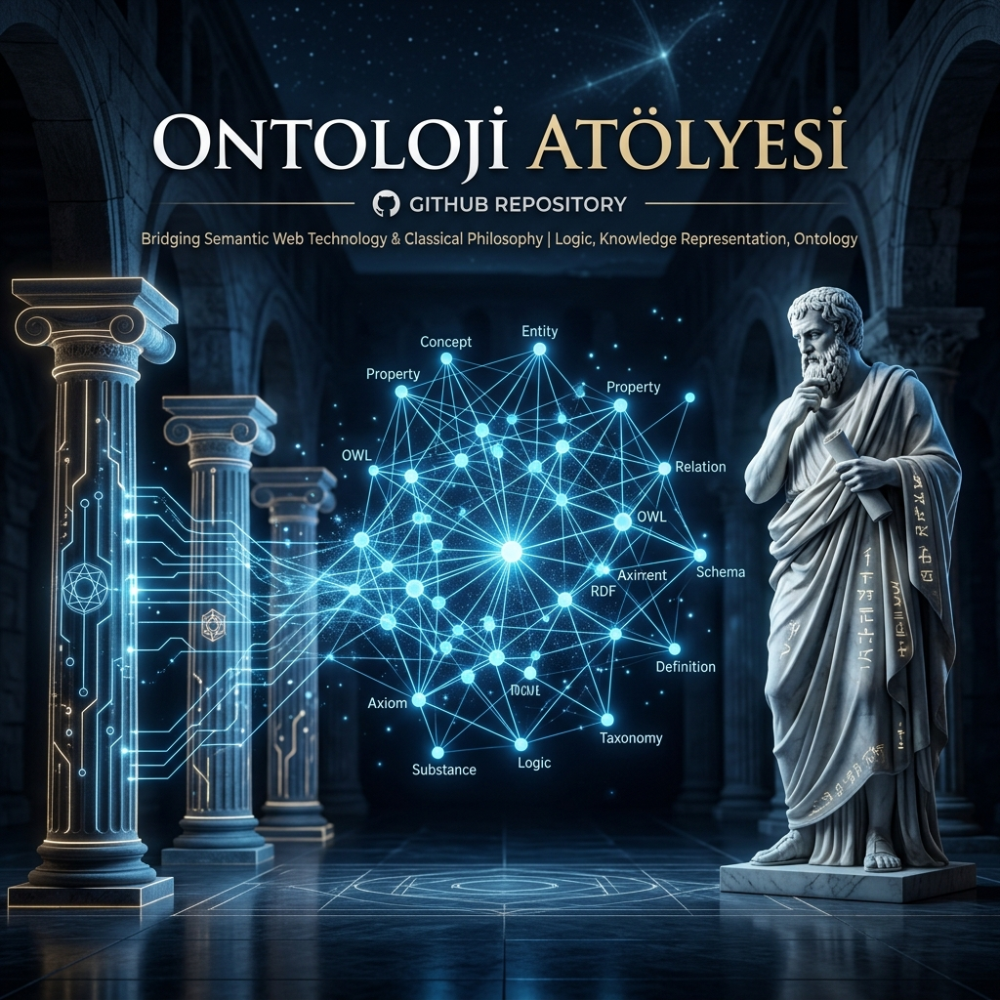
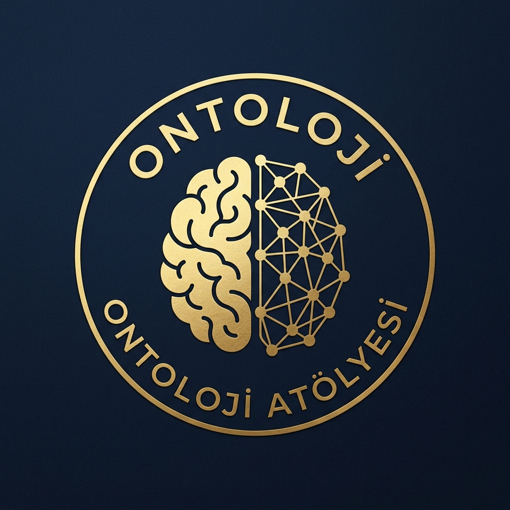
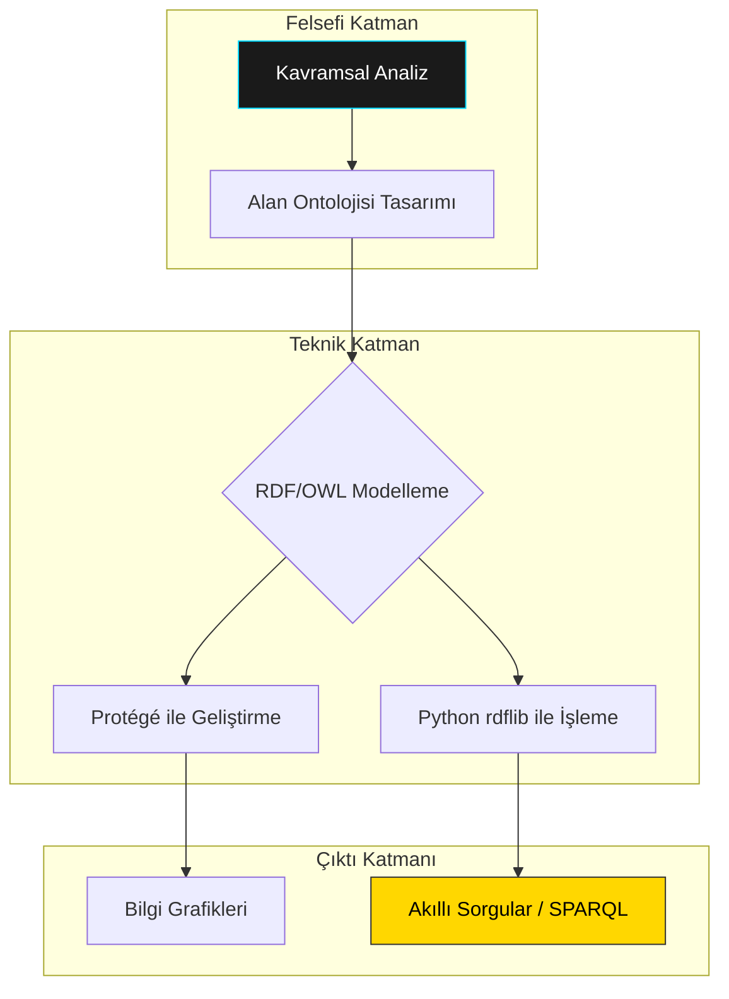

<p align="center">
  
</p>

<p align="center">
  
</p>

<h1 align="center">🧠 Ontoloji Atölyesi (ontoloji-atolyesi)</h1>

<p align="center">
  <strong>"Varlığı Veriye, Veriyi Bilgiye, Bilgiyi Hikmete Dönüştürme Merkezi"</strong>
</p>

<p align="center">
  <a href="https://github.com/arch-yunus/ontoloji-atolyesi/stargazers"></a>
  <a href="https://github.com/arch-yunus/ontoloji-atolyesi/network/members"></a>
  <a href="https://github.com/arch-yunus/ontoloji-atolyesi/issues"></a>
  
</p>

---

## 🌟 Vizyon ve Motivasyon

"Varlık nedir?" sorusu binlerce yıldır felsefenin merkezinde yer almıştır. Bugün ise bu soru, **Yapay Zeka** ve **Semantik Web** dünyasının en teknik sorularından biri haline geldi: *"Bir bilgisayara dünyayı nasıl anlatırız?"*

**Ontoloji Atölyesi**, bu felsefi derinliği modern veri standartlarıyla (RDF, OWL, SPARQL) birleştiren kapsamlı bir laboratuvardır. Amacımız, sadece veri depolamak değil, veriler arasındaki **anlamsal ilişkileri** modelleyerek bilgisayarların "anlamasını" sağlamaktır.

> [!TIP]
> Bir veri tabanı "ne olduğunu" bilir, bir ontoloji ise "neden öyle olduğunu" ve "ne anlama geldiğini" açıklar.

---

## 🗺️ Müfredat Yol Haritası (Master Plan)

Atölye çalışmalarımız dört ana evreden oluşmaktadır. Her bir evre, bir sonrakinin temelini oluşturur.

| Aşama | Başlık | Fokus | Teknik Araçlar | Durum |
| :--- | :--- | :--- | :--- | :--- |
| **01** | **Felsefi Temeller** | Töz, İlinek, Hiyerarşi | Markdown & Diyagramlar | ✅ Tamamlandı |
| **02** | **Semantik Standartlar** | RDF, RDFS, OWL Katmanları | Turtle, XML, JSON-LD | ✅ Devam Ediyor |
| **03** | **Uygulamalı Modelleme** | Taksonomi ve Akıl Yürütme | Protégé & HermiT | 🚀 Gelişiyor |
| **04** | **Yazılım Entegrasyonu** | Python & Bilgi Grafiklerinden Sorgulama | rdflib & owlready2 | 🔥 Sıcak |

---

## 📖 Temel Kavramlar Sözlüğü

Burası sadece kod değil, aynı zamanda bir bilgi hazinesidir.

- **Töz (Substance):** Kendi başına var olan şey (Örn: İnsan).
- **İlinek (Accident):** Tözün bir özelliği (Örn: İnsanın rengi, boyu).
- **Sınıf (Class) / Concept:** Varlıkların hiyerarşik gruplandırılması.
- **Birey (Individual):** Sınıfın somut örneği (Örn: Sokrates bir İnsan'dır).
- **Özellik (Property):** Sınıflar arası ilişkiler (Örn: `babasıdır`, `çalışanıdır`).
- **Aksiyom (Axiom):** Ontolojideki kesin doğrular ve kurallar.

---

## 🏗️ Mimari Yapı



---

## 📂 Klasör Yapısı ve İçerikler

Aşağıdaki yapı, atölyenin öğrenme eğrisini yansıtır:

- 📂 **[01-teori-ve-felsefe](01-teori-ve-felsefe/):** Aristoteles'ten modern bilgi mühendisliğine kadar uzanan teorik notlar.
- 📂 **[02-teknik-standartlar](02-teknik-standartlar/):** W3C standartları, RDF üçlüleri (Triples) ve OWL 2 rehberleri.
- 📂 **[03-modelleme-projeleri](03-modelleme-projeleri/):** `.owl` uzantılı, Protégé ile açılabilen somut modeller. (Aile ağacı, E-ticaret vb.)
- 📂 **[04-sorgulama-ve-kod](04-sorgulama-ve-kod/):** Python betikleri ve SPARQL sorgu örnekleri.
- 📂 **[docs](docs/):** Kurulum rehberleri ve ek kaynaklar.

---

## 🚀 Başlıyoruz (Quick Start)

### 1. Ortam Kurulumu
Öncelikle gerekli kütüphaneleri yükleyin:

```bash
git clone https://github.com/arch-yunus/ontoloji-atolyesi.git
cd ontoloji-atolyesi
pip install -r requirements.txt
```

### 2. Ontoloji İşleme (Python)
Ontolojilerimizle programatik olarak etkileşime geçmek için:

```python
from rdflib import Graph

# Ontolojiyi yükle
g = Graph()
g.parse("03-modelleme-projeleri/aile-agaci.owl")

# Basit bir sorgu çalıştır
q = """
SELECT ?isim WHERE {
    ?birey rdf:type aile:Insan .
    ?birey rdfs:label ?isim .
}
"""
# (Not: Namespace tanımları Python dosyasında mevcuttur)
```

---

## 🛠️ Araç Setimiz

Profesyonellerin kullandığı, atölyemizin temelini oluşturan araçlar:

1.  **[Protégé Desktop](https://protege.stanford.edu/):** Açık kaynaklı, genişletilebilir ontoloji editörü.
2.  **[GraphDB](https://www.ontotext.com/products/graphdb/):** Yüksek performanslı anlamsal veri tabanı.
3.  **[Python rdflib](https://github.com/RDFLib/rdflib):** Kod ile ontoloji manipülasyonu.
4.  **[OWLready2](https://owlready2.readthedocs.io/):** Python nesneleri ile ontolojiyi eşleştiren güçlü araç.
5.  **[Shakespeare SPL](https://shakespearelang.com/):** Egzotik ve sanatsal varlık modelleme dili.
6.  **[Prolog](https://www.swi-prolog.org/):** Saf mantık ve aksiyom çözümleme dili.

---

## 🎨 Egzotik ve Mantıksal Paradigmalar

Atölyemizde sadece standart diller değil, varlığın doğasına farklı açılardan bakan paradigmalar da kullanılır:

- **Artistic Ontology (SPL):** `04-sorgulama-ve-kod/egzotik/` altında Aristoteles ve Platon'un diyalogları üzerinden varlık "hesaplamaları" yapılır.
- **Logical Reasoning (Prolog):** `04-sorgulama-ve-kod/mantik/` altında tümdengelimsel akıl yürütme kuralları ile ontolojik sorgular çözülür.

---

## 🤝 Katkıda Bulunma

Bu atölye sürekli büyüyen bir organizmadır! Eğer:
- Yeni bir felsefi makale yazmak,
- Karmaşık bir `.owl` modeli eklemek,
- SPARQL sorguları optimize etmek isterseniz...

Lütfen bir **Fork** oluşturun ve **Pull Request** gönderin. Sizin de bir "Varlık" tanımınız olsun!

---

<p align="center">
  <i>"Veri sadece birer rakamdır, anlam ise o rakamların birbirine duyduğu bağlılıkta saklıdır."</i>
  <br>
  <strong>Ontoloji Atölyesi - 2024</strong>
</p>
