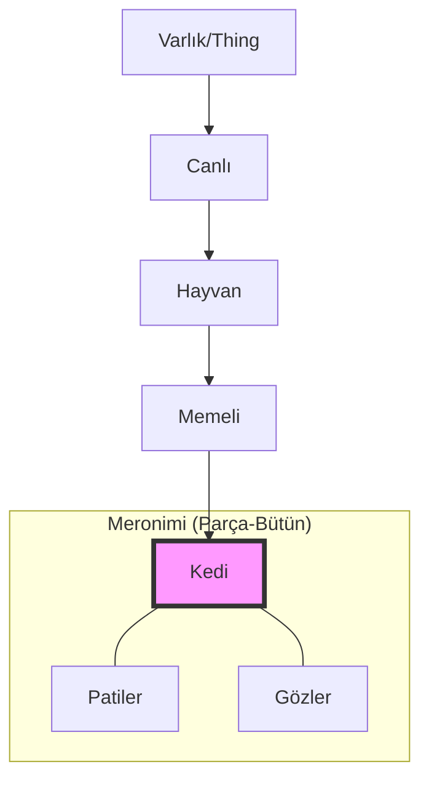

# 🧠 Ontoloji Atölyesi (ontoloji-atolyesi)
> **"Varlığı Veriye, Veriyi Bilgiye Dönüştürme Merkezi"**

[]()
[]()
[]()

---

## 🚀 Vizyon

"Varlık nedir?" sorusundan yola çıkıp, "Bir bilgisayara dünyayı nasıl anlatırız?" sorusuna yanıt arıyoruz. Bu atölye, felsefi ontolojiyi modern dünya teknolojileriyle (Yapay Zeka, Bilgi Mühendisliği, Semantik Web) harmanlayan derinlemesine bir öğrenme yolculuğudur.

---

## 📚 Müfredat Yol Haritası

| Aşama | Başlık | İçerik | Detay |
| :--- | :--- | :--- | :--- |
| **01** | **Teorik Temeller** | Töz, İlinek, Evrenseller | [İncele](01-teori-ve-felsefe/temel-kavramlar.md) |
| **02** | **Teknik Standartlar** | RDF, RDFS, OWL | [İncele](02-teknik-standartlar/rdf-rdfs-giris.md) |
| **03** | **Modelleme** | Aile Ağacı, E-Ticaret | [İncele](03-modelleme-projeleri/) |
| **04** | **Sorgulama** | SPARQL & Python | [İncele](04-sorgulama-ve-kod/) |

---

## 🏗️ Örnek Ontoloji Hiyerarşisi

Sistemlerimizde sınıflar arası ilişkileri (Taksonomi) ve parça-bütün ilişkilerini (Meronimi) şu şekilde modelliyoruz:



---

## 📂 Klasör Yapısı

```text
ontoloji-atolyesi/
├── 01-teori-ve-felsefe/       # Makaleler ve temel terminoloji
├── 02-teknik-standartlar/     # RDF, OWL teknik notlar
├── 03-modelleme-projeleri/    # .owl uzantılı örnek projeler
├── 04-sorgulama-ve-kod/       # SPARQL ve Python uygulamaları
└── docs/                      # Faydalı kaynaklar
```

---

## 🛠️ Kullanılan Araçlar

1. **[Protégé Desktop](https://protege.stanford.edu/):** Dünyanın en popüler açık kaynak ontoloji editörü.
2. **Python `rdflib`:** Ontolojileri kod ile yönetmek için.
   ```bash
   pip install rdflib
   ```

---

## 🤝 Katkıda Bulunma

Bu bir açık atölyedir! Farklı alanlarda (E-ticaret, Tıp, Mimari vb.) ontoloji modelleri eklemek isterseniz lütfen Pull Request gönderin.

---
<p align="center">
  <i>"Sözcükler arasındaki ilişkiler, dünyanın dokusunu oluşturur."</i>
</p>
